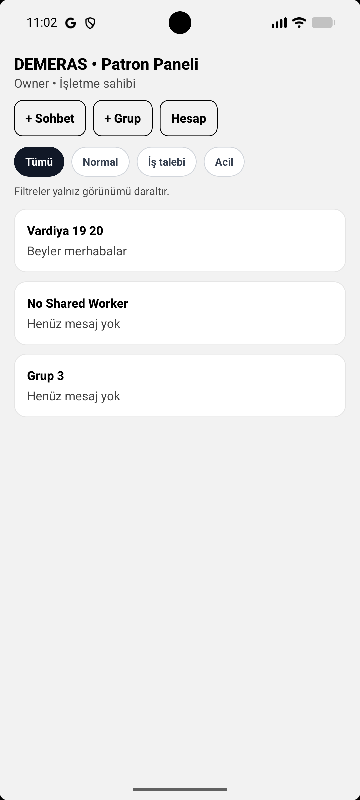
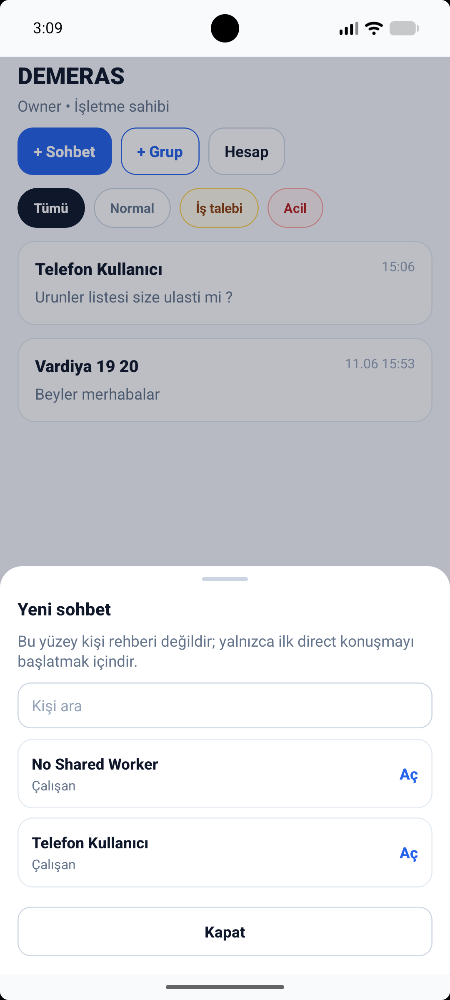
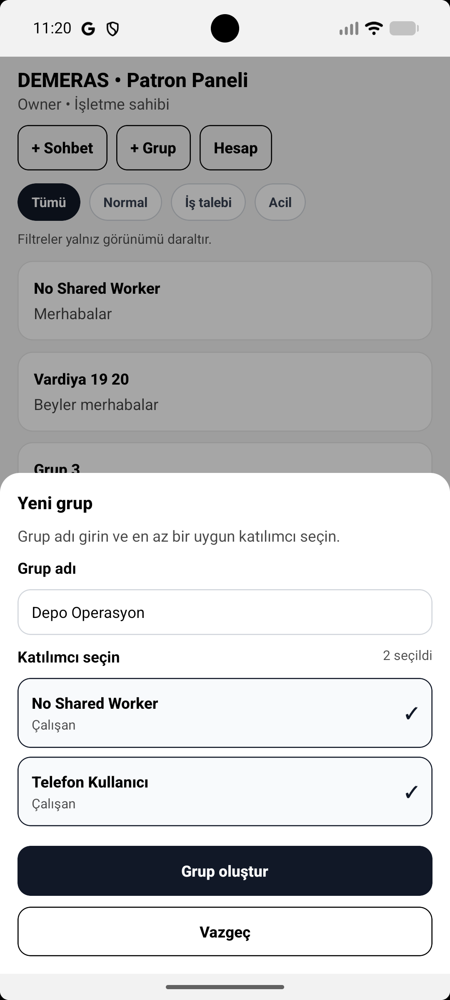
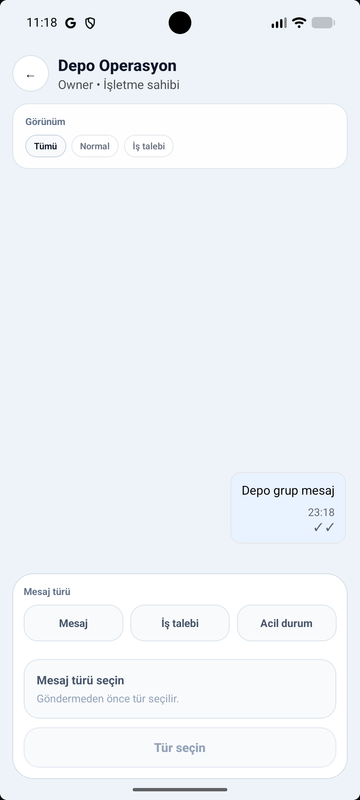
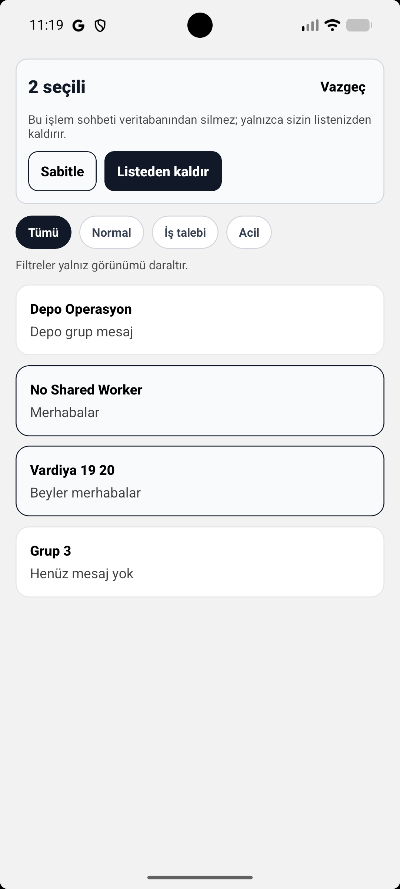
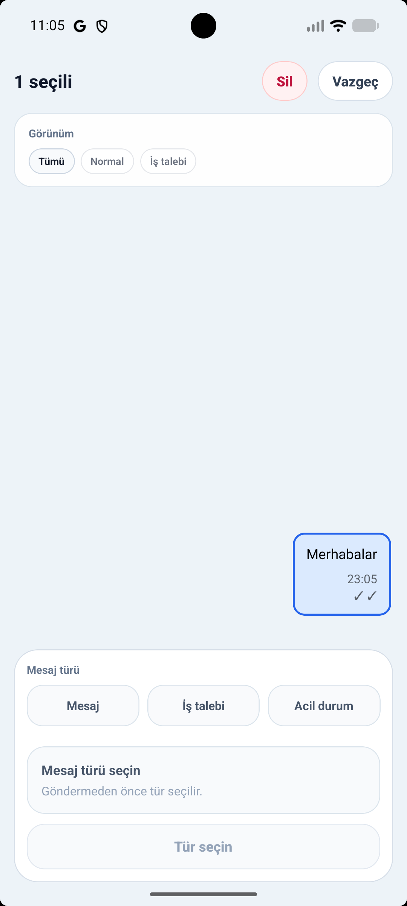

# DEMERAS - Mobile Operations Case Study

DEMERAS is a role-based mobile operations app built as an MIS/YBS portfolio case-study. It explores how small businesses can move from informal chat and verbal follow-up toward clearer operational communication, role-aware conversations and documented demo evidence. Demo Freeze v1 focuses on Android smoke-tested direct and group conversation flows.

## Türkçe Özet

DEMERAS, küçük işletmelerde WhatsApp benzeri dağınık iletişimin yerine daha düzenli, rol bazlı ve kayıt mantığı olan bir operasyon iletişimi deneyimi tasarlamak için geliştirilmiş bir mobil uygulama case-study projesidir.

Bu proje; Yönetim Bilişim Sistemleri bakış açısıyla iş analizi, ürün düşüncesi, mobil arayüz tasarımı, React Native / Expo geliştirme, Supabase Auth, RLS/RPC servis sınırları ve Android smoke test süreçlerini göstermek amacıyla hazırlanmıştır.

Demo Freeze v1 kapsamında doğrudan sohbet başlatma, grup sohbeti oluşturma, mesaj gönderme, sohbet listesi yönetimi ve mesaj seçme/silme gibi temel akışlar Android üzerinde test edilmiştir.

Bu proje gerçek müşteri, gelir, canlı pilot veya production kullanım iddiası taşımaz; CV, portföy, staj ve mülakatlarda açıklanabilir teknik/ürün kanıtı olarak sunulmaktadır.

---

## Problem Statement

Small-business teams often coordinate work through informal chat, phone calls or verbal reminders. This can make it hard to track who is responsible, which request belongs to which group, and whether an operational message actually reached the right person.

DEMERAS models that problem as a mobile product and turns it into a case-study for business analysis, product thinking and mobile development.

---

## Solution Overview

DEMERAS is designed as a controlled operations inbox rather than a general social chat app.

The app focuses on:

- Role-based access and communication.
- ChatList as the main operations surface.
- Direct conversation creation for focused one-to-one coordination.
- Group conversation creation for small team coordination.
- Evidence-driven checkpoints and Android smoke testing.

---

## Screenshots

### Role-based ChatList / Owner Panel

The owner dashboard shows role-based access, conversation filters, direct chat creation, group chat creation, and account access from a single mobile screen.

### Start a Direct Conversation

The direct conversation sheet allows an owner or manager to start a one-to-one operational conversation with an eligible team member.

### Create a Group Conversation

The group creation flow supports naming a team conversation and selecting multiple eligible participants before creating the group.

### Group Chat Detail

The group chat screen supports operational messaging with message type controls such as normal message, job request, and emergency.

### Multi-select Conversation Actions

ChatList supports multi-select actions such as pinning and removing conversations from the user’s own list without deleting the underlying business records.

### Message Selection / Soft Delete UI

Own normal or job messages can be selected for controlled soft deletion. DEMERAS avoids hard delete behavior and keeps audit-friendly business records.

---

## Core Features Completed In Demo Freeze v1

- Login/session path verified during Android smoke testing.
- ChatList opened successfully.
- Direct conversation creation flow completed.
- Group conversation creation flow completed.
- ChatDetail navigation verified.
- First group message sent successfully.
- Return to ChatList and new group card verified.
- No red screen observed during the tested direct/group paths.

## Direct Conversation Flow Proof

Android smoke-tested direct flow:

1. `+ Sohbet` CTA visible.
2. Eligible users listed.
3. User selected.
4. ChatDetail opened.
5. Empty/direct conversation state rendered.
6. No red screen observed.

---

## Group Conversation Flow Proof

Android smoke-tested group flow:

1. `+ Grup` CTA visible.
2. Group creation modal opened.
3. Group name input worked.
4. Eligible participants listed.
5. Participant selection worked.
6. Group creation submitted.
7. ChatDetail opened for the new group.
8. First group message sent.
9. Returned to ChatList and the new group card appeared.
10. No red screen observed.

---

## Tech Stack

- React Native / Expo.
- Supabase Auth.
- Supabase RLS/RPC boundaries.
- Role-based access design.
- Android smoke testing.
- Git checkpoint and evidence discipline.

---

## Architecture Summary

The application is organized around role-aware product flows:

- UI screens present the role-based operations experience.
- Conversation services handle direct and group creation boundaries.
- Supabase Auth provides identity/session behavior.
- Supabase RLS/RPC supports safer backend access patterns.
- Documentation records tested behavior, known deferred scope and demo readiness.

---

## Demo Freeze v1 Status

Status: reached and documented.

Demo Freeze v1 means the project has a stable, explainable portfolio checkpoint with Android smoke evidence for the direct and group conversation vertical slices. It does not mean production launch, customer deployment or app-store publication.

---

## Intentionally Deferred

- Real media/photo upload.
- Incident center redesign.
- Broader Supabase PR19/21/22/23/24/25 work.
- Notification polish.
- Production hardening.
- Google Play release, unless completed in a future checkpoint.
- Full employee/business-systems management surface, currently archived/vNext.

---

## What I Learned

- How to translate a business communication problem into scoped product flows.
- How to define demo evidence instead of relying on vague “it works” claims.
- How to build React Native / Expo flows backed by Supabase Auth and role-aware service boundaries.
- How to separate completed demo proof from deferred technical work.
- How to keep portfolio language honest and useful for CV, internship and interview contexts.

---

## Honest Disclaimer

DEMERAS is presented as a portfolio/demo project and MIS/YBS case-study.

It does not claim:

- real paying customers,
- revenue,
- production usage,
- real company adoption,
- live pilot results,
- Google Play publication.

The current proof is Demo Freeze v1 with documented Android smoke evidence.
